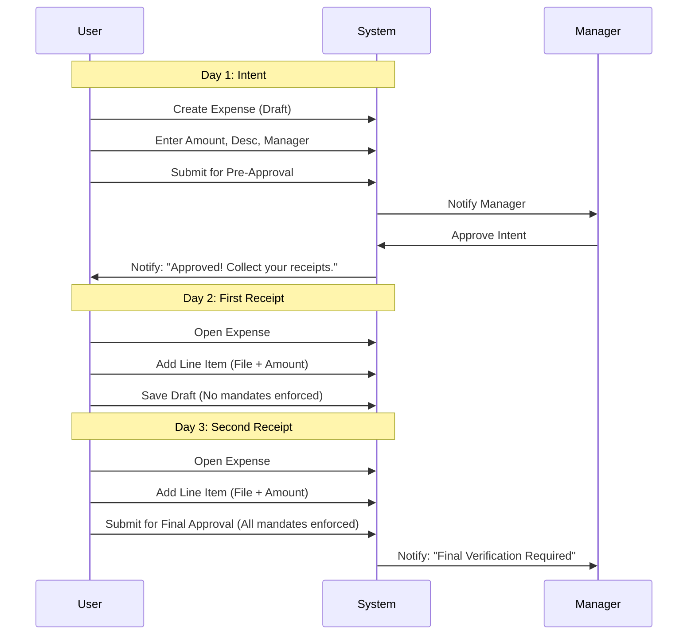

# UX Design Specification expense-app

**Author:** Afzal
**Date:** 2025-12-27

---

<!-- UX design content will be appended sequentially through collaborative workflow steps -->

## Executive Summary

### Project Vision
A premium, high-performance SaaS B2B fintech app focused on "Dopamine-Driven Design" (DDD). The goal is <200ms perceived latency, minimalist aesthetics, and tactile micro-feedback (pulses/glows) for state transitions. The primary differentiator is radical simplicity compared to existing complex enterprise solutions.

### Target Users
- **Sales, QA, and HR Professionals:** Low-to-moderate tech savviness.
- **Office & Mobile Workers:** Using laptops at the desk and phones on the move.
- **Preference for Predictability:** Avoid complex gesture controls; favor clear, accessible UI elements (buttons, clear labels).

### Key Design Challenges
- **Simplicity vs. Flow:** Reducing complexity for non-technical users while maintaining the strictness of the approval state machine.
- **Hybrid Accessibility:** Ensuring high-fidelity polish works equally well for mouse-driven desktop use and touch-driven mobile use without relying on gestures.
- **Privacy Barrier:** Creating a clear "mental model" for the boundary between the private Vault and public Org space.

### Design Opportunities
- **Clarified Tactility:** Using DDD feedback (glows/pulses) to guide users through the process without needing dense instruction manuals.
- [x] **Contextual Simplicity:** Showing only what is necessary for the current task (e.g., minimalist receipt capture for Sales vs. structured audit for Finance).

## Core User Experience

### Defining Experience
The heartbeat of the app is the **"Snap & Upload"** loop. Success is defined by the speed and reliability of transforming a physical receipt into a digital record with minimal friction. This is followed immediately by the **"Submit for Approval"** action, which transitions the expense from the private Vault into the collaborative Org space.

### Platform Strategy
- **Web-First (Responsive):** Optimized for both desk-bound laptop use and on-the-go phone use.
- **Traditional Interaction Model:** Clear, predictable UI elements (buttons, menus) over complex mobile gestures to accommodate non-technical users.
- **No PWA (Phase 1):** Focus on a high-fidelity browser experience; PWA/Offline features are deferred to later phases.

### Effortless Interactions
- **Manager Review Loop:** The "Check & Approve" process for managers must be completely seamless. Viewing an expense should immediately present the uploaded files and line items in a side-by-side or overlaid view that requires zero navigation to verify.
- **Zero-Manual-Entry (Goal):** While OCR is part of the future, the initial goal is making the upload and categorization feel effortless through smart defaults and a focused UI.

### Critical Success Moments
- **The "Magical Moment":** The transition from individual receipt capture to a high-level **Visual Overview**. The user feels accomplished when they see their "Vault" or "Org Spending" represented through intuitive graphs and charts, giving them instant clarity on their financial state.
- **Submission Feedback:** The tactile "Success" pulse when an expense is successfully submitted, confirming it's "off their plate."

### Experience Principles
1. **Speed to Capture:** The path from opening the app to seeing an upload progress bar must be the fastest interaction.
2. **Reviewer Clarity:** Facilitate "Zero-Friction Approvals" by putting data and evidence (receipts) in a single, unified view.
3. **Insight-First Dashboard:** The dashboard is an engine for clarity, not just a list of items.
4. **Accessible Polish:** High-fidelity animations (DDD) used to guide and reward, never to obscure or complicate.

## Desired Emotional Response

### Primary Emotional Goals
- **Calm Reliability:** Users should feel that the "Vault" is a safe, effortless place to stash financial records. The act of uploading should feel like "checking a box" rather than starting a complex task.
- **Professional Mastery:** Managers should feel a sense of clarity and power when reviewing expenses. They should feel like the system is doing the hard work of organization for them.

### Emotional Journey Mapping
- **Discovery/Onboarding:** *Relief* — "Finally, an app that doesn't look like a 1990s banking portal."
- **Core Loop (Snap & Upload):** *Instant Gratification* — The speed and micro-feedback (glows) should make a mundane task feel slightly rewarding.
- **Review & Approval:** *Efficiency* — Managers feel productive, not bogged down by paperwork.
- **Magical Moment (Dashboard):** *Clarity* — Seeing the graphs should provide an "Aha!" moment of financial understanding.

### Micro-Emotions
- **Trust (Priority 1):** Receipt uploads must feel bulletproof. Even a 500ms delay without a loader creates "Data Loss Anxiety."
- **Confidence:** Clear, unambiguous button labels over cryptic icons to ensure users never feel "dumb" or stuck.
- **Delight:** Subtle satisfaction from the Dopamine-Driven micro-interactions.

### Design Implications
- **Calm Reliability** → Use a curated, harmonious color palette (HSL-tailored) and avoid "Alert Red" for non-critical errors.
- **Efficiency** → Implement side-by-side receipt/data views for managers to eliminate "Back & Forth" anxiety.
- **Trust** → Persistent "Saved" indicators and immediate optimistic UI updates.

### Emotional Design Principles
1. **Never Leave them Guessing:** Every action has an immediate, high-fidelity visual response.
2. **Standardize the Success:** Use a consistent "Success Glow" (DDD) for everything from saves to submissions to build a "Reward Loop."
3. **Minimize Choice Paralysis:** Limit visible actions based on the user's role and current state.

## UX Pattern Analysis & Inspiration

### Inspiring Products Analysis
- **Slack:** Mastery of **"Immediacy"** and **"Presence."** We'll adopt Slack's pattern of clear, real-time status indicators for expense transitions (e.g., "Reviewing", "Approved").
- **Instagram:** Focus on **"Visual Fluidity"** and **"High-Density Speed."** Like Instagram, capturing a receipt should feel fast and visually prioritized. We'll use large, clear image previews and skeleton loaders to maintain perceived velocity.
- **Gmail:** Excellence in **"Efficient List Management."** We'll adopt Gmail's pattern of clear primary actions (e.g., the floating "+" button for new expenses) and scannable list item density.

### Transferable UX Patterns
- **Navigation:** A clean, bottom-bar navigation (Mobile) and sidebar (Desktop) similar to Slack/Gmail for quick switching between the Vault and Org views.
- **Interaction:** One-click actions for approvals, similar to archiving an email in Gmail.
- **Visuals:** High-fidelity "Success" pulses (DDD) inspired by the satisfying interaction feel of Instagram's likes and Slack's emoji reactions.

### Anti-Patterns to Avoid
- **"Field Fatigue":** Avoiding Jira's complexity by prioritizing **Contextual Disclosure**—only showing fields when they are actually needed.
- **"Navigational Labyrinths":** Avoiding nested tabs and complex sub-menus. The path to upload or approve must be linear and shallow.
- **"Robotic Language":** Avoiding bureaucratic copy; favoring professional yet human-centric labels.

### Design Inspiration Strategy
- **What to Adopt:** The "Action-First" layout of Gmail and the real-time feedback loop of Slack.
- **What to Adapt:** Instagram's "Grid" view for the Vault to make browsing receipts feel visual and intuitive.
- **What to Avoid:** The "Configuration-First" mentality of Jira; prioritizing simplicity for Sales/HR.

## Design System Foundation

### Design System Choice
Themeable & Specialized Design System based on **Shadcn UI**, **Tailwind CSS v4**, and **Motion 12**.

### Rationale for Selection
- **Ecosystem Sync:** Leverages the existing Next-Starter foundation.
- **Dopamine-Driven Design (DDD):** Provides the specific animation capabilities (Motion 12) and visual polish (@tailark, @efferd, etc.) required for the premium Fintech feel.
- **Accessibility:** Shadcn primitives ensure WCAG 2.1 compliance for non-technical users.

### Implementation Approach
- Use specialized registries (`@tailark`, `@animate-ui`, `@efferd`, `@shadcn-studio`) for advanced components.
- Maintain feature-first organization inside `@/features/[feature]/components`.
- Centralize DDD tokens in `@/styles/globals.css`.

### Customization Strategy
- **Tokens:** Define specific HSL colors for the brand palette and custom pulse/glow duration tokens.
- **Interactions:** Standardize on a "Reward Interaction" pattern for all positive state changes.

## 2. Core User Experience

### 2.1 Defining Experience: The "Life of an Expense"
The defining experience is the **gradual evolution** of an expense from a simple intent (Pre-approval) to a verified financial record (Approval). It centers on the **Multi-Day Lifecycle** where users can accumulate line items over time.

### 2.2 User Mental Model: The "Incremental Folder"
Users think of an Expense not as a single file, but as a **Progressive Folder**. 
- **Intent Phase:** "I'm planning to spend X."
- **Collection Phase:** "I'm adding receipts as they happen."
- **Verification Phase:** "Everything is here, please approve."

### 2.3 The "Smart Mandate" Rules
Mandatoriness scales with the "Commit Level":
| State | Goal | Mandatory Fields |
| :--- | :--- | :--- |
| **Draft** | Save progress | *None* |
| **Pre-Approval** | Intent verification | Amount, Manager Email |
| **Approval** | Final Reimbursement | Files, Amount, Manager, Category |

### 2.4 Novel UX Patterns
- **Dopamine-Driven Feedback:** Using premium micro-interactions (glows/pulses) to reward mundane tasks.
- **The "Vault to Org" Bridge:** A high-fidelity transition animation that signals the boundary between private and shared data.

### 2.5 Experience Mechanics
1. **Initiation:** Floating "Capture" button, always one tap away.
2. **Interaction:** Passive background upload with an active, pulsing progress indicator.
3. **Feedback:** "Success Glow" on completion; item appears at top of Vault.
4. **Completion:** State transitions (Draft -> Submitted) reflected in the audit trail instantly.

## Visual Design Foundation

### Color System
- **Theme:** **Standard Professional (Next-Starter Default)**
- **Primary/Base:** Default Shadcn/Tailwind Indigo/Slate/Zinc palette.
- **Dopamine Accents:** Emerald (#10B981) for success glows and positive state changes.

### Typography System
- **Fonts:** Default Shadcn stack (Inter).
- **Focus:** Clarity, legibility, and large touch targets for non-technical users.

### Spacing & Layout Foundation
- **Grid:** Strict 8px base grid.
- **Feel:** **Airy & Functional** — Clean, predictable layouts that prioritize content over style.

## Design Direction Decision

### 2.5 Experience Mechanics: The Multi-Line Flow
1. **Initiation:** Top-level "Create Expense" start (Selects Manager & Purpose).
2. **Granular Line Items:** Each "Add Item" action creates a self-contained record containing:
   - **Amount:** Specific to this receipt/item.
   - **Description:** Context for this specific item.
   - **Files:** Multiple attachments (e.g., receipt + proof of payment).
   - **Date:** The actual date of the transaction.
3. **State Transitions:** One-tap submission transitions (Draft -> Pre-Approve -> Approved -> Submit).
   - *Note:* The "Total Amount" of the Expense is the sum of all active line items.
4. **Dopamine Nudge:** Visual "Checkmarks" or "Glows" as each mandatory field for the next state is satisfied.

## 3. User Journey Flows

### 3.1 The "Incremental Expense" Lifecycle

### 3.2 Journey Pattern: The "Progressive Disclosure" Form
To prevent "Field Fatigue," the form only highlights fields required for the *currently requested* state change.
- **Pre-Approval Mode:** Highlights Manager & Amount.
- **Approval Mode:** Highlights File Upload & Category.

### 3.3 Journey Patterns
- **The "Success Glow":** A consistent neon emerald aura signal.
- **The "Fluid Focus":** Automatic focus on the next high-priority task.
- **The "Progressive Glow":** A subtle amber-to-emerald transition for the Submit button as mandatory fields are filled.

## 4. Component Strategy

### 4.1 Design System Foundation (Shadcn)
We leverage standard Shadcn/Tailwind components to ensure development speed and reliability:
- **`Card` & `Accordion`:** Grouping containers for multi-line expenses.
- **`Form` & `Input`:** High-contrast, Inter-based rapid entry fields.
- **`Drawer` / `Sheet`:** Context-aware overlays for "Capture Expense."
- **`Resizable`:** Side-by-side verification Panels for Managers.

### 4.2 Custom "Dopamine-Driven" Components (Motion 12)
These components extend the base library to provide the premium feel:
- **`SuccessGlow` Wrapper:** Pulsing neon-emerald aura for satisfied mandates.
- **`BentoItemCard`:** Premium card variant for line items with "Audit Seal."
- **`LiquidProgressBar`:** Ultra-smooth file upload progress.
- **`LifecycleStepper`:** Visual state-tracker with "Success Pulses."

### 4.3 Implementation Roadmap
- **Phase 1 (Core):** `ExpenseContainer` and `LineItemEditor` with basic validation.
- **Phase 2 (Dopamine):** `Motion 12` integration for glows and transitions.
- **Phase 3 (Review):** `ReviewerDashboard` with the Resizable split-view.

## 5. UX Consistency Patterns

### 5.1 Button Hierarchy: The "Ignition" Pattern
To drive momentum and reduce cognitive load, buttons use a **Smart State** lifecycle:
- **Inactive (The Void):** Buttons for state transitions (Submit/Approve) remain "Dead Slate" (disabled) while mandates are incomplete. This leverages the *Zeigarnik Effect*, creating a mental "open loop" that the user wants to close.
- **Active (The Ignition):** Once mandates are satisfied, the button "ignites" with a pulsing **Success Glow** (Emerald). This provides an immediate dopamine reward before the user even clicks.

### 5.2 Feedback Loops: "Reframing Correction"
To maintain user confidence and "Professional Mastery," we reframe errors:
- **Success Loops:** High-fidelity Emerald pulses and "Audit Seals" signal accomplishment.
- **Correction Loops:** Avoid harsh "Error Red." Rejections or missing data are signaled with **Soft Amber Pulses** and framed as "Ready for Review" or "Needs Detail." This minimizes anxiety and encourages completion.

### 5.3 Empty States: The "Living Canvas"
Empty views (Vault/Queue) are designed to feel active, not vacant:
- **Skeleton Invitations:** Use pulsing skeleton loaders even on empty states to show *where* a new expense will live. 
- **Action Prompts:** A single, high-contrast **[+] Capture Expense** button serves as the primary goal-gradient trigger.

### 5.4 Form Patterns: "Progressive Disclosure"
Only show fields required for the *next* milestone (e.g., don't ask for a receipt during Pre-approval). This prevents "Field Fatigue" and keeps the user in a state of flow.

## 6. Responsive Design & Accessibility

### 6.1 Responsive Strategy
- **Mobile-First Capture:** The "Capture Expense" journey is optimized for one-handed phone use, with large touch targets and simplified forms.
- **Desktop-First Review:** The Manager Dashboard and Finance Audit views utilize a multi-column, side-by-side layout for maximum information density and efficiency.
- **Fluid Adaptation:** Using Tailwind CSS v4's fluid utilities to ensure typography and spacing scale harmoniously between breakpoints.

### 6.2 Breakpoint Strategy
We utilize standard Shadcn/Tailwind breakpoints:
- **Mobile (sm):** 640px (Default view for capture).
- **Tablet (md):** 768px (Optimized list views).
- **Desktop (lg):** 1024px (Split-view review mode enabled).

### 6.3 Accessibility Strategy
- **Compliance Level:** WCAG 2.1 Level AA.
- **Form Labels:** Every Shadcn input specifically carries an explicit `<Label>` with associated `htmlFor` for screen readers.
- **Keyboard Navigation:** Reviewers can process the queue using `Tab`, `Space/Enter`, and custom `Cmd+S` (Submit) / `Cmd+A` (Approve) shortcuts.
- **Motion Control:** All Motion 12 pulses and glows respect the `prefers-reduced-motion` media query.

### 6.4 Testing Strategy
- **Screen Reader Testing:** Mandatory VoiceOver (macOS/iOS) testing on the "Submit" and "Approve" flows.
- **Device Lab:** Real-device testing on popular iPhone/Android screen sizes to ensure hit-target accessibility.
