# Comprehensive UX Design Specifications - Expense App

## Executive Summary

This document provides comprehensive UX design specifications for all user stories in the expense management SaaS application. The design follows the established "Minimalist Dopamine" philosophy, leveraging Shadcn UI, Tailwind CSS v4, and Motion 12 for premium, high-performance interactions.

**Key Design Principles:**
- **Dopamine-Driven Design (DDD):** Immediate feedback with tactile micro-interactions
- **<200ms Perceived Latency:** GPU-accelerated animations and optimistic UI
- **Progressive Disclosure:** Show only necessary fields based on context
- **Accessibility First:** WCAG 2.1 AA compliance with reduced motion support

---

## Story 1.1: Project Scaffolding & Core Expense Schema

### User Journey Flow
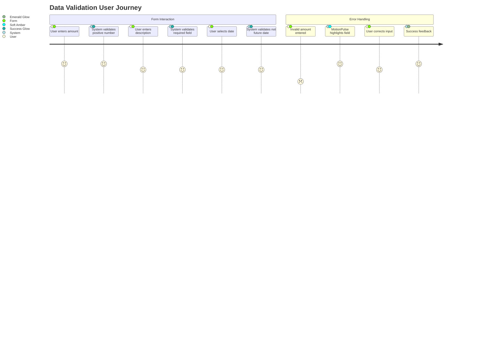
```mermaid
journey
  title Data Validation User Journey
  section Form Interaction
    User enters amount: 5: User, Form
    System validates positive number: 5: System, Success Glow
    User enters description: 4: User, Form  
    System validates required field: 4: System, Success Glow
    User selects date: 4: User, Form
    System validates not future date: 4: System, Success Glow
  section Error Handling
    Invalid amount entered: 2: User, Form
    MotionPulse highlights field: 5: System, Soft Amber
    User corrects input: 4: User, Form
    Success feedback: 5: System, Emerald Glow
```

### Wireframe Concepts
- **Validation States:** Real-time field validation with color-coded feedback
- **Success Glow:** Emerald aura (box-shadow: 0 0 15px #10B981) for valid inputs
- **MotionPulse:** Soft amber scale animation for invalid fields
- **Progressive Feedback:** Immediate validation without blocking form completion

### Component Requirements (Feature Component Pattern)
```typescript
// @/components/ddd/SuccessGlow.tsx
interface SuccessGlowProps {
  children: React.ReactNode;
  trigger: boolean;
  intensity?: 'subtle' | 'medium' | 'strong';
}

// @/components/ddd/MotionPulse.tsx  
interface MotionPulseProps {
  children: React.ReactNode;
  error: boolean;
  message?: string;
}

// @/lib/validations/expense.ts
export const expenseSchema = z.object({
  lineItems: z.array(z.object({
    amount: z.number().positive('Must be positive'),
    description: z.string().min(1, 'Required'),
    date: z.date().max(new Date(), 'Cannot be future date'),
    attachments: z.array(z.string()).optional()
  })).min(1, 'At least one item required')
});
```

### Interaction Patterns (DDD Principles)
- **Immediate Validation:** Field-level validation triggers instantly on blur/change
- **Success Glow:** Emerald aura pulses for 300ms when validation passes
- **Soft Correction:** Amber MotionPulse (scale: [1, 1.02, 1]) for errors, not harsh red
- **Progressive Enhancement:** Form remains functional even with validation errors

### Responsive Design Considerations
- **Mobile:** Single-column layout with stacked validation messages
- **Desktop:** Multi-column form layout with inline validation indicators
- **Touch Targets:** Minimum 44px height for all interactive validation elements

### Accessibility Requirements
- **Screen Reader:** Field validation announced immediately with aria-live="polite"
- **Color Independence:** Validation states use both color and iconography
- **Keyboard Navigation:** Tab order follows logical validation sequence
- **Reduced Motion:** Respects prefers-reduced-motion, glows become static highlights

---

## Story 1.2: Users Private Vault Dashboard

### User Journey Flow
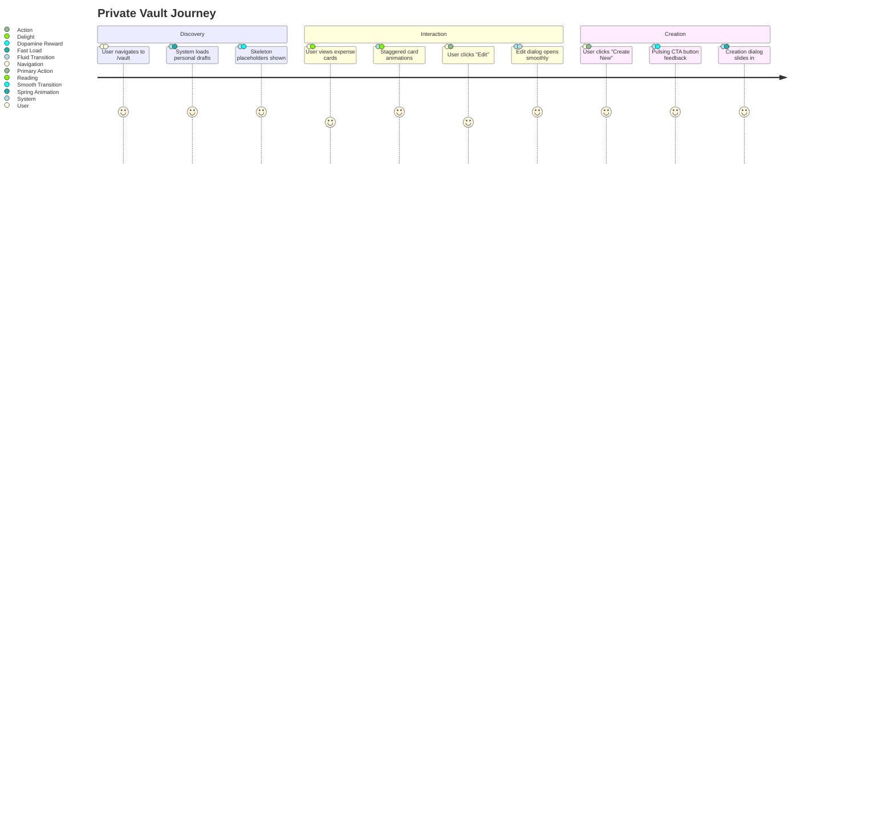
```mermaid
journey
  title Private Vault Journey
  section Discovery
    User navigates to /vault: 5: User, Navigation
    System loads personal drafts: 5: System, Fast Load
    Skeleton placeholders shown: 5: System, Smooth Transition
  section Interaction
    User views expense cards: 4: User, Reading
    Staggered card animations: 5: System, Delight
    User clicks "Edit": 4: User, Action
    Edit dialog opens smoothly: 5: System, Fluid Transition
  section Creation
    User clicks "Create New": 5: User, Primary Action
    Pulsing CTA button feedback: 5: System, Dopamine Reward
    Creation dialog slides in: 5: System, Spring Animation
```

### Wireframe Concepts
- **Privacy-First Header:** Lock icon with "Private Vault" messaging
- **Expense Cards:** Clean cards with draft status badges
- **Empty State:** Welcoming canvas with skeleton invitation
- **Action Buttons:** Prominent "Create New" with pulsing CTA
- **Privacy Indicators:** Subtle lock icons and "Private" badges

### Component Requirements (Feature Component Pattern)
```typescript
// app/dashboard/vault/page.tsx
export default function VaultPage() {
  return (
    <PageTransition>
      <VaultHeader />
      <VaultContent />
    </PageTransition>
  );
}

// app/dashboard/vault/_components/vault-content.tsx
interface VaultContentProps {
  expenses: PersonalExpense[];
  isLoading: boolean;
}

export function VaultContent({ expenses, isLoading }: VaultContentProps) {
  if (isLoading) return <SkeletonExpenseList />;
  if (expenses.length === 0) return <VaultEmptyState />;
  
  return (
    <StaggeredList>
      {expenses.map(expense => (
        <VaultExpenseCard key={expense.id} expense={expense} />
      ))}
    </StaggeredList>
  );
}
```

### Interaction Patterns (DDD Principles)
- **Page Entry:** Spring animation settles content into place
- **Card Loading:** Staggered entrance animations (100ms delays)
- **Privacy Assurance:** Lock icon provides trust and security dopamine
- **Empty State Delight:** Skeleton loaders create "living canvas" expectation
- **CTA Pulsing:** Soft amber pulse on "Create New" button (scale: [1, 1.01, 1])

### Responsive Design Considerations
- **Mobile:** Single-column card stack with full-width buttons
- **Tablet:** 2-column grid layout for expense cards
- **Desktop:** 3-column grid with expanded card details

### Accessibility Requirements
- **Focus Management:** Logical tab order through vault actions
- **Screen Reader:** "Private vault with X draft expenses" announcement
- **Keyboard Shortcuts:** Cmd/Ctrl+N for new expense creation
- **Color Contrast:** Privacy badges meet WCAG AA standards

---

## Story 1.3: Capture New Personal Expense (1-N Items)

### User Journey Flow
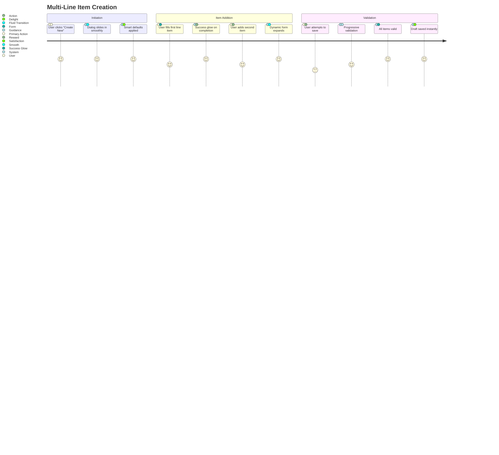
```mermaid
journey
  title Multi-Line Item Creation
  section Initiation
    User clicks "Create New": 5: User, Primary Action
    Dialog slides in smoothly: 5: System, Fluid Transition
    Smart defaults applied: 5: System, Delight
  section Item Addition
    User fills first line item: 4: User, Form
    Success glow on completion: 5: System, Reward
    User adds second item: 4: User, Action
    Dynamic form expands: 5: System, Smooth
  section Validation
    User attempts to save: 3: User, Action
    Progressive validation: 4: System, Guidance
    All items valid: 5: System, Success Glow
    Draft saved instantly: 5: System, Satisfaction
```

### Wireframe Concepts
- **Dynamic Form:** Add/remove line item buttons with smooth animations
- **Smart Defaults:** Current date, focus on first amount field
- **Progressive Disclosure:** Fields revealed as user progresses
- **Total Calculation:** Live NumberTicker for sum display
- **Save Options:** Draft vs Submit toggle with clear state implications

### Component Requirements (Feature Component Pattern)
```typescript
// app/dashboard/expenses/_components/create-expense-dialog.tsx
interface CreateExpenseDialogProps {
  open: boolean;
  onOpenChange: (open: boolean) => void;
}

export function CreateExpenseDialog({ open, onOpenChange }: CreateExpenseDialogProps) {
  const [lineItems, setLineItems] = useState<LineItemFormData[]>([defaultItem]);
  
  return (
    <Dialog open={open} onOpenChange={onOpenChange}>
      <DialogContent className="max-w-2xl">
        <SuccessGlow trigger={saveSuccess}>
          <form onSubmit={handleSubmit}>
            <DynamicLineItems 
              items={lineItems}
              onChange={setLineItems}
              onAdd={() => addLineItem()}
              onRemove={(index) => removeLineItem(index)}
            />
            <TotalDisplay total={calculateTotal(lineItems)} />
            <ActionButtons 
              onDraft={() => saveAsDraft()}
              onSubmit={() => submitForApproval()}
            />
          </form>
        </SuccessGlow>
      </DialogContent>
    </Dialog>
  );
}
```

### Interaction Patterns (DDD Principles)
- **Form Expansion:** Smooth height animation when adding line items
- **Field Completion:** Success glow pulses on valid field completion
- **Live Calculation:** NumberTicker animates total changes fluidly
- **Save Feedback:** Immediate button state change + SuccessGlow on save
- **Progressive Validation:** Fields highlight required next steps

### Responsive Design Considerations
- **Mobile:** Full-screen dialog with stacked line items
- **Tablet:** Optimized dialog width with horizontal item layout
- **Desktop:** Multi-column layout for complex expense forms

### Accessibility Requirements
- **Dynamic Content:** aria-live announcements for total changes
- **Form Navigation:** Proper fieldset grouping for line items
- **Error Association:** aria-describedby links validation messages
- **Keyboard Support:** Enter to add items, Delete to remove

---

## Story 1.4: Receipt Attachment Pipeline (UploadThing)

### User Journey Flow
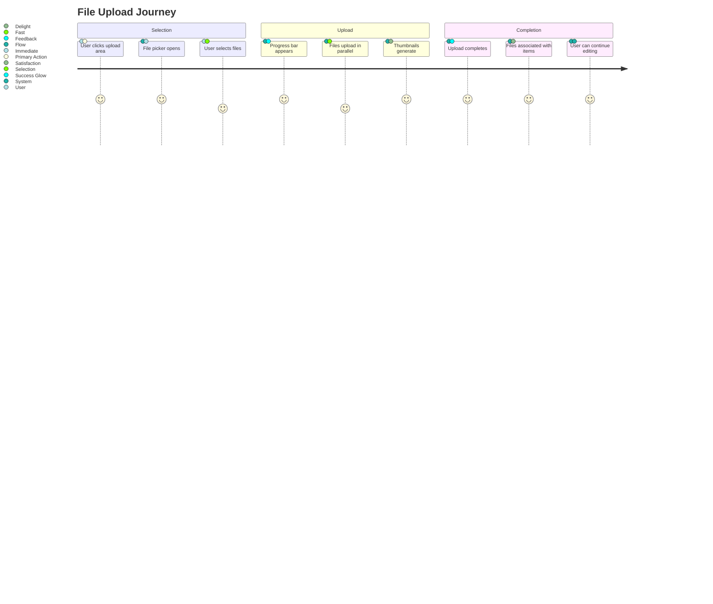
```mermaid
journey
  title File Upload Journey
  section Selection
    User clicks upload area: 5: User, Primary Action
    File picker opens: 5: System, Immediate
    User selects files: 4: User, Selection
  section Upload
    Progress bar appears: 5: System, Feedback
    Files upload in parallel: 4: System, Fast
    Thumbnails generate: 5: System, Delight
  section Completion
    Upload completes: 5: System, Success Glow
    Files associated with items: 5: System, Satisfaction
    User can continue editing: 5: System, Flow
```

### Wireframe Concepts
- **Drag-and-Drop Zones:** Visual drop areas per line item
- **Upload Progress:** Liquid progress bars with file names
- **File Previews:** Thumbnail grid with remove options
- **Error States:** Soft amber highlights for failed uploads
- **Mobile Camera:** Direct camera access button

### Component Requirements (Feature Component Pattern)
```typescript
// components/ui/file-upload.tsx
interface FileUploadProps {
  onFilesSelected: (files: File[]) => void;
  maxFiles?: number;
  accept?: string;
  lineItemId: string;
}

export function FileUpload({ 
  onFilesSelected, 
  maxFiles = 5, 
  accept = "image/*,.pdf",
  lineItemId 
}: FileUploadProps) {
  const [uploadProgress, setUploadProgress] = useState<Record<string, number>>({});
  
  return (
    <div className="file-upload-zone">
      <input
        type="file"
        multiple
        accept={accept}
        onChange={handleFileSelection}
        className="hidden"
        id={`file-upload-${lineItemId}`}
      />
      <label htmlFor={`file-upload-${lineItemId}`}>
        <MotionPulse error={hasError}>
          <div className="drop-zone">
            {isUploading ? (
              <LiquidProgressBar progress={uploadProgress} />
            ) : (
              <UploadPrompt />
            )}
          </div>
        </MotionPulse>
      </label>
      <FilePreviewGrid files={uploadedFiles} onRemove={handleRemove} />
    </div>
  );
}
```

### Interaction Patterns (DDD Principles)
- **Upload Initiation:** Immediate visual feedback on click/drag
- **Progress Animation:** Liquid progress bar with smooth fill animation
- **Completion Reward:** Success glow on successful uploads
- **Error Recovery:** Soft amber pulse for failures with retry options
- **Thumbnail Loading:** Staggered reveal of uploaded file previews

### Responsive Design Considerations
- **Mobile:** Camera button prioritized, drag-drop secondary
- **Tablet:** Hybrid approach with both camera and drag-drop
- **Desktop:** Full drag-drop experience with keyboard support

### Accessibility Requirements
- **File Input:** Proper label association and keyboard activation
- **Progress:** aria-valuenow for screen reader progress updates
- **Errors:** Clear error messages with suggested actions
- **Camera Access:** Permission request with clear purpose explanation

---

## Story 1.5: Draft Management (Edit/Delete)

### User Journey Flow
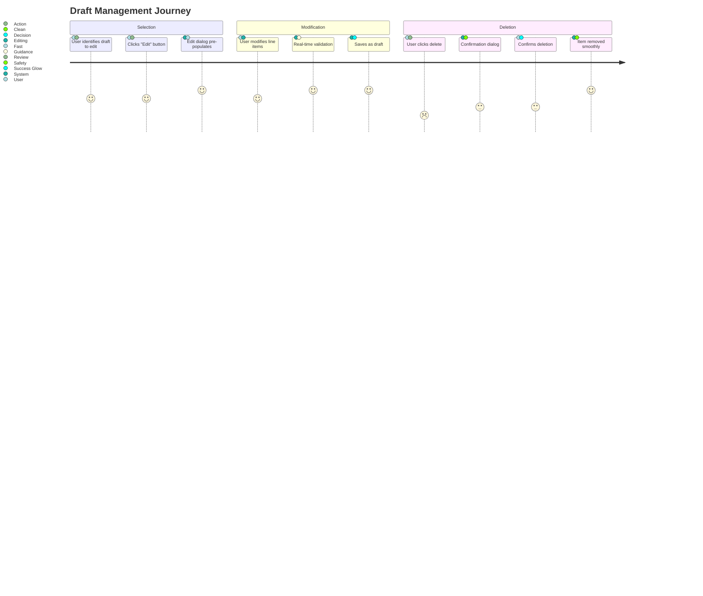
```mermaid
journey
  title Draft Management Journey
  section Selection
    User identifies draft to edit: 4: User, Review
    Clicks "Edit" button: 4: User, Action
    Edit dialog pre-populates: 5: System, Fast
  section Modification
    User modifies line items: 4: User, Editing
    Real-time validation: 5: System, Guidance
    Saves as draft: 5: System, Success Glow
  section Deletion
    User clicks delete: 2: User, Action
    Confirmation dialog: 3: System, Safety
    Confirms deletion: 3: User, Decision
    Item removed smoothly: 5: System, Clean
```

### Wireframe Concepts
- **Edit Dialog:** Pre-populated form with existing data
- **Delete Confirmation:** Clear warning with item summary
- **Audit Trail Preview:** Changes highlighted in edit mode
- **Save States:** Clear draft vs submit options
- **Undo Capability:** Recent changes can be reverted

### Component Requirements (Feature Component Pattern)
```typescript
// app/dashboard/expenses/_components/edit-expense-dialog.tsx
interface EditExpenseDialogProps {
  expense: Expense;
  open: boolean;
  onOpenChange: (open: boolean) => void;
}

export function EditExpenseDialog({ expense, open, onOpenChange }: EditExpenseDialogProps) {
  const [changes, setChanges] = useState<ExpenseChanges>({});
  
  return (
    <Dialog open={open} onOpenChange={onOpenChange}>
      <DialogContent className="max-w-2xl">
        <EditForm 
          initialData={expense}
          onChange={setChanges}
          onSave={() => handleSave(changes)}
        />
        <AuditTrailPreview changes={changes} />
        <ActionButtons
          onSaveDraft={() => saveAsDraft(changes)}
          onDelete={() => confirmDelete(expense.id)}
        />
      </DialogContent>
    </Dialog>
  );
}

// app/dashboard/expenses/_components/delete-confirmation.tsx
interface DeleteConfirmationProps {
  expense: Expense;
  onConfirm: () => void;
  onCancel: () => void;
}

export function DeleteConfirmation({ expense, onConfirm, onCancel }: DeleteConfirmationProps) {
  return (
    <AlertDialog>
      <AlertDialogContent>
        <AlertDialogHeader>
          <AlertDialogTitle>Delete Draft Expense?</AlertDialogTitle>
          <AlertDialogDescription>
            This will permanently delete "{expense.description}" 
            and cannot be undone.
          </AlertDialogDescription>
        </AlertDialogHeader>
        <ExpenseSummary expense={expense} />
        <AlertDialogFooter>
          <AlertDialogCancel onClick={onCancel}>Cancel</AlertDialogCancel>
          <AlertDialogAction onClick={onConfirm} className="bg-destructive">
            Delete Expense
          </AlertDialogAction>
        </AlertDialogFooter>
      </AlertDialogContent>
    </AlertDialog>
  );
}
```

### Interaction Patterns (DDD Principles)
- **Edit Loading:** Smooth pre-population with skeleton placeholders
- **Change Tracking:** Subtle highlights on modified fields
- **Save Success:** Emerald SuccessGlow with field-level change confirmation
- **Delete Safety:** Confirmation dialog prevents accidental deletion
- **Undo Feedback:** Toast notification with potential undo action

### Responsive Design Considerations
- **Mobile:** Full-screen edit dialogs with bottom action sheet
- **Tablet:** Optimized dialog sizing with side-by-side layout
- **Desktop:** Multi-panel layout with change preview

### Accessibility Requirements
- **Form Pre-population:** Screen reader announces "Editing expense X"
- **Change Tracking:** aria-describedby for modified field indicators
- **Deletion Warnings:** High contrast warning colors and clear language
- **Keyboard Confirmation:** Enter to confirm, Escape to cancel

---

## Story 1.6: Fix Uppy Dropzones in Create Expense Modal

### User Journey Flow
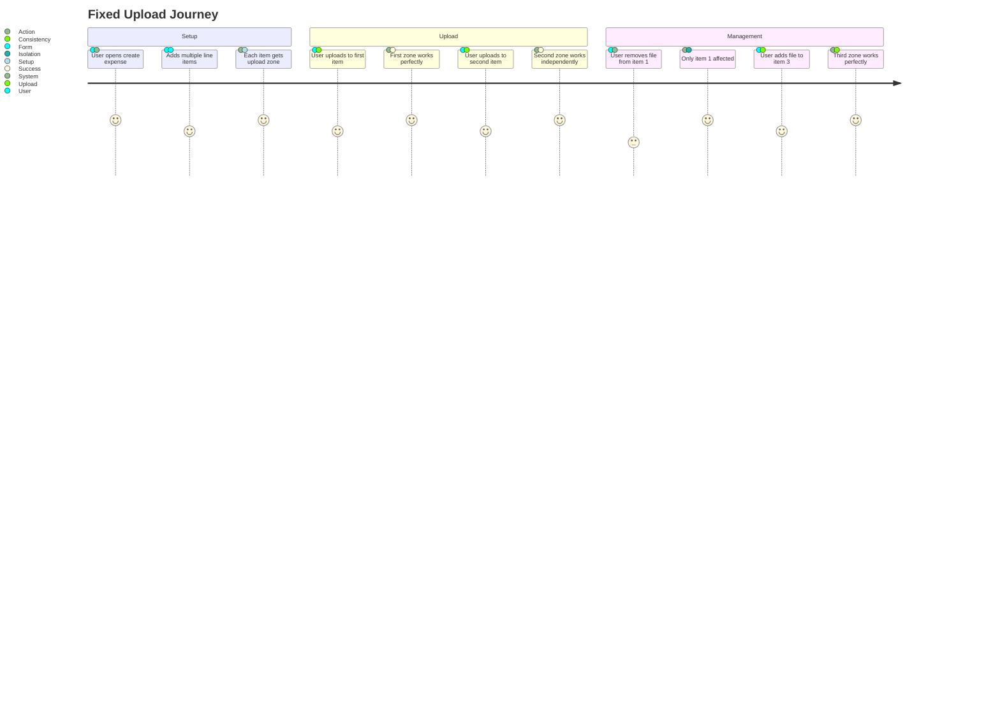
```mermaid
journey
  title Fixed Upload Journey
  section Setup
    User opens create expense: 5: User, Action
    Adds multiple line items: 4: User, Form
    Each item gets upload zone: 5: System, Setup
  section Upload
    User uploads to first item: 4: User, Upload
    First zone works perfectly: 5: System, Success
    User uploads to second item: 4: User, Upload
    Second zone works independently: 5: System, Success
  section Management
    User removes file from item 1: 3: User, Action
    Only item 1 affected: 5: System, Isolation
    User adds file to item 3: 4: User, Upload
    Third zone works perfectly: 5: System, Consistency
```

### Wireframe Concepts
- **Isolated Dropzones:** Each line item has independent upload functionality
- **State Management:** Upload progress and errors contained per zone
- **File Association:** Clear visual linkage between files and line items
- **Error Containment:** Failed uploads don't affect other zones

### Component Requirements (Feature Component Pattern)
```typescript
// Fix: Isolated Uppy instances per line item
interface LineItemWithUploadProps {
  item: LineItemFormData;
  index: number;
  onChange: (index: number, item: LineItemFormData) => void;
}

export function LineItemWithUpload({ item, index, onChange }: LineItemWithUploadProps) {
  // Each line item gets its own Uppy instance
  const uppy = useUppyInstance(`line-item-${index}`);
  
  const handleUploadSuccess = (result: UploadResult) => {
    const updatedItem = {
      ...item,
      attachments: [...(item.attachments || []), ...result.files.map(f => f.url)]
    };
    onChange(index, updatedItem);
  };
  
  return (
    <div className="line-item-container">
      <LineItemFields item={item} onChange={(field, value) => {
        const updatedItem = { ...item, [field]: value };
        onChange(index, updatedItem);
      }} />
      <FileUploadZone 
        uppy={uppy}
        onSuccess={handleUploadSuccess}
        onError={(error) => handleUploadError(index, error)}
      />
    </div>
  );
}
```

### Interaction Patterns (DDD Principles)
- **Independent Operation:** Each dropzone works without interfering with others
- **Individual Feedback:** Upload progress and errors isolated per zone
- **Consistent Experience:** Same interaction patterns across all dropzones
- **State Isolation:** File management actions affect only their line item

### Responsive Design Considerations
- **Mobile:** Stacked layout with clear zone separation
- **Tablet:** Side-by-side item and upload zones
- **Desktop:** Full multi-column layout with upload zones

### Accessibility Requirements
- **Zone Identification:** Clear labels associating uploads with line items
- **Progress Tracking:** Individual progress announcements per zone
- **Error Association:** Error messages linked to specific line items
- **Keyboard Navigation:** Tab order flows logically through all zones

---

## Story 2.1: The "Org Guard" Middleware & Layout

### User Journey Flow
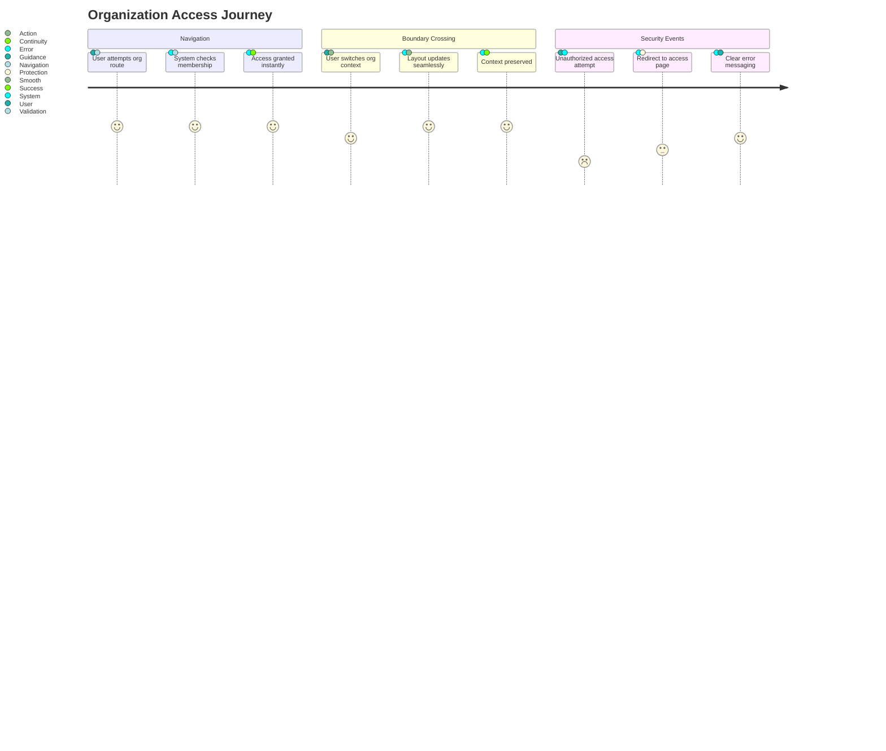
```mermaid
journey
  title Organization Access Journey
  section Navigation
    User attempts org route: 5: User, Navigation
    System checks membership: 5: System, Validation
    Access granted instantly: 5: System, Success
  section Boundary Crossing
    User switches org context: 4: User, Action
    Layout updates seamlessly: 5: System, Smooth
    Context preserved: 5: System, Continuity
  section Security Events
    Unauthorized access attempt: 2: User, Error
    Redirect to access page: 3: System, Protection
    Clear error messaging: 4: System, Guidance
```

### Wireframe Concepts
- **Access Denied Page:** Clean error state with join/redirect options
- **Org Context Indicator:** Subtle header showing current organization
- **Role-Based UI:** Dynamic navigation based on user permissions
- **Seamless Switching:** Instant context changes without full page reload

### Component Requirements (Feature Component Pattern)
```typescript
// app/dashboard/[orgId]/layout.tsx
interface OrgLayoutProps {
  children: React.ReactNode;
  params: { orgId: string };
}

export function OrgLayout({ children, params }: OrgLayoutProps) {
  const { org, userRole } = useOrgContext(params.orgId);

  return (
    <div className="min-h-screen">
      <OrgHeader org={org} userRole={userRole} />
      <OrgNavigation role={userRole} />
      {children}
    </div>
  );
}

// lib/middleware/org-guard.ts
export async function orgGuard(request: NextRequest, orgId: string) {
  const session = await auth.api.getSession({ headers: await headers() });
  if (!session) return redirect('/login');

  const membership = await db.organizationMembers.findOne({
    organizationId: orgId,
    userId: session.user.id
  });

  if (!membership) return redirect('/access-denied');
  return { membership };
}
```

### Interaction Patterns (DDD Principles)
- **Instant Validation:** Sub-200ms access checks with optimistic loading
- **Context Preservation:** Smooth org switching with layout transitions
- **Clear Boundaries:** Visual indicators for org vs personal spaces
- **Error Recovery:** Helpful redirection with join options

### Responsive Design Considerations
- **Mobile:** Collapsible org selector in header
- **Desktop:** Sidebar org switcher with quick access
- **Tablet:** Adaptive navigation preserving context

### Accessibility Requirements
- **Screen Reader:** Announces org context changes
- **Keyboard Navigation:** Org switcher accessible via keyboard
- **Error Announcements:** Access denied states clearly communicated

---

## Story 2.2: Create and Manage Organizations

### User Journey Flow
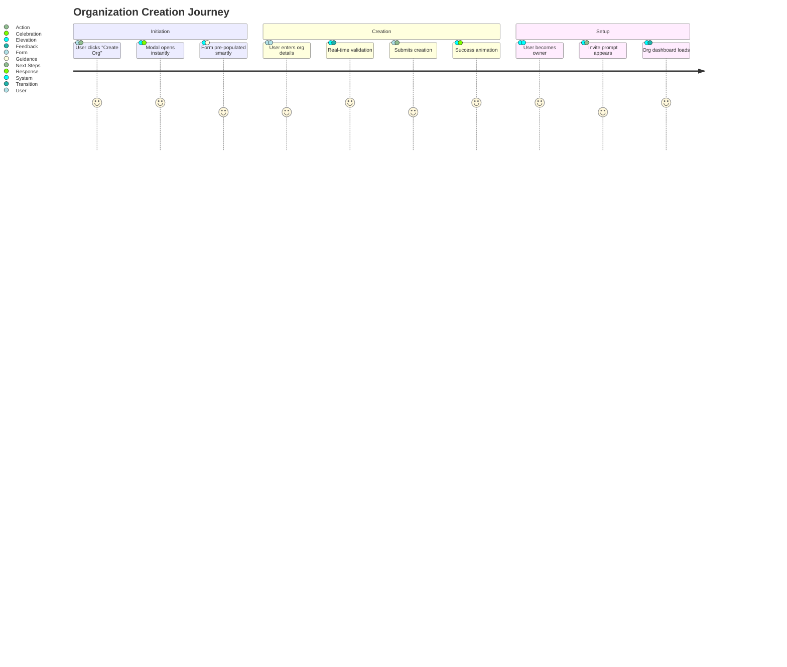
```mermaid
journey
  title Organization Creation Journey
  section Initiation
    User clicks "Create Org": 5: User, Action
    Modal opens instantly: 5: System, Response
    Form pre-populated smartly: 4: System, Guidance
  section Creation
    User enters org details: 4: User, Form
    Real-time validation: 5: System, Feedback
    Submits creation: 4: User, Action
    Success animation: 5: System, Celebration
  section Setup
    User becomes owner: 5: System, Elevation
    Invite prompt appears: 4: System, Next Steps
    Org dashboard loads: 5: System, Transition
```

### Wireframe Concepts
- **Creation Modal:** Clean form with org name and optional description
- **Success Celebration:** Emerald glow with confetti animation
- **Owner Dashboard:** Immediate access to management features
- **Smart Defaults:** Pre-filled based on user context

### Component Requirements (Feature Component Pattern)
```typescript
// components/features/CreateOrganization.tsx
interface CreateOrganizationProps {
  onSuccess?: (org: Organization) => void;
}

export function CreateOrganization({ onSuccess }: CreateOrganizationProps) {
  const [isCreating, setIsCreating] = useState(false);

  const handleSubmit = async (data: CreateOrgForm) => {
    setIsCreating(true);
    try {
      const org = await createOrganizationAction(data);
      // Success animation with confetti
      await animateSuccess();
      onSuccess?.(org);
    } finally {
      setIsCreating(false);
    }
  };

  return (
    <Dialog>
      <DialogTrigger asChild>
        <Button className="gap-2">
          <Plus className="h-4 w-4" />
          Create Organization
        </Button>
      </DialogTrigger>
      <DialogContent>
        <CreateOrgForm onSubmit={handleSubmit} />
      </DialogContent>
    </Dialog>
  );
}
```

### Interaction Patterns (DDD Principles)
- **Instant Feedback:** Form validation with SuccessGlow on valid fields
- **Celebration Moment:** Confetti animation on successful creation
- **Seamless Transition:** Direct navigation to org dashboard
- **Progressive Enhancement:** Form works without JavaScript

### Responsive Design Considerations
- **Mobile:** Full-screen modal optimized for touch
- **Desktop:** Inline creation with quick access
- **Tablet:** Balanced modal sizing

### Accessibility Requirements
- **Form Labels:** Explicit labels with aria-describedby
- **Success Announcements:** Screen reader celebrates creation
- **Keyboard Support:** Full keyboard navigation

---

## Story 2.3: Invite Members & Role Management

### User Journey Flow
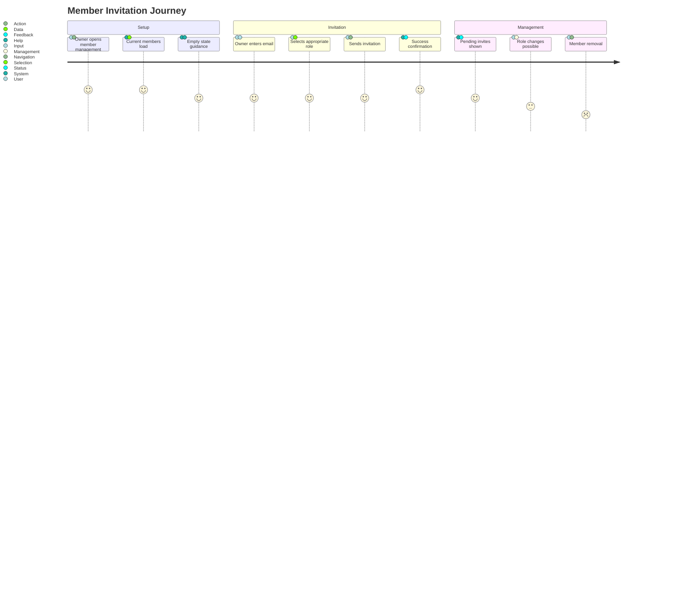
```mermaid
journey
  title Member Invitation Journey
  section Setup
    Owner opens member management: 5: User, Navigation
    Current members load: 5: System, Data
    Empty state guidance: 4: System, Help
  section Invitation
    Owner enters email: 4: User, Input
    Selects appropriate role: 4: User, Selection
    Sends invitation: 4: User, Action
    Success confirmation: 5: System, Feedback
  section Management
    Pending invites shown: 4: System, Status
    Role changes possible: 3: User, Management
    Member removal: 2: User, Action
```

### Wireframe Concepts
- **Member Table:** Clear list with status indicators
- **Role Selector:** Dropdown with permission explanations
- **Invitation Form:** Email input with role selection
- **Status Badges:** Pending/Active/Admin/Employee indicators

### Component Requirements (Feature Component Pattern)
```typescript
// components/features/InviteMember.tsx
interface InviteMemberProps {
  orgId: string;
  onMemberAdded?: () => void;
}

export function InviteMember({ orgId, onMemberAdded }: InviteMemberProps) {
  const handleInvite = async (email: string, role: MemberRole) => {
    await inviteMemberAction({ orgId, email, role });
    // Success animation
    toast.success('Invitation sent!');
    onMemberAdded?.();
  };

  return (
    <Card>
      <CardHeader>
        <CardTitle>Invite Team Member</CardTitle>
      </CardHeader>
      <CardContent>
        <InviteForm onSubmit={handleInvite} />
      </CardContent>
    </Card>
  );
}

// components/features/ManageMembers.tsx
interface ManageMembersProps {
  orgId: string;
}

export function ManageMembers({ orgId }: ManageMembersProps) {
  const { members, isLoading } = useOrgMembers(orgId);

  if (isLoading) return <MemberSkeleton />;

  return (
    <div className="space-y-4">
      {members.map(member => (
        <MemberRow key={member.id} member={member} />
      ))}
      <InviteMember orgId={orgId} />
    </div>
  );
}
```

### Interaction Patterns (DDD Principles)
- **Optimistic Updates:** Invitation appears instantly in pending list
- **Role Clarity:** Tooltips explain permissions for each role
- **Status Transitions:** Smooth animations for invite acceptance
- **Batch Operations:** Select multiple for role changes

### Responsive Design Considerations
- **Mobile:** Card-based member list
- **Desktop:** Table with bulk actions
- **Tablet:** Hybrid layout

### Accessibility Requirements
- **Table Navigation:** Proper table semantics
- **Role Descriptions:** Screen reader friendly role explanations
- **Status Updates:** Announced changes to member status

---

## Story 2.4: Reactive Linking Flow (Guest to Member)

### User Journey Flow
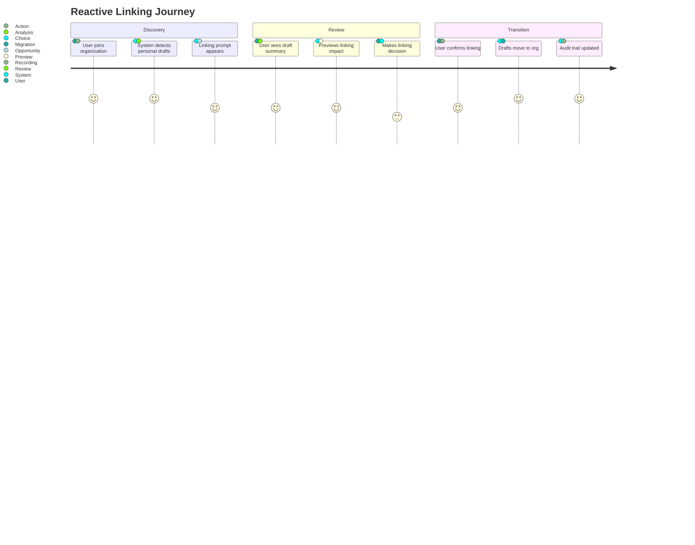
```mermaid
journey
  title Reactive Linking Journey
  section Discovery
    User joins organization: 5: User, Action
    System detects personal drafts: 5: System, Analysis
    Linking prompt appears: 4: System, Opportunity
  section Review
    User sees draft summary: 4: User, Review
    Previews linking impact: 4: System, Preview
    Makes linking decision: 3: User, Choice
  section Transition
    User confirms linking: 4: User, Action
    Drafts move to org: 5: System, Migration
    Audit trail updated: 5: System, Recording
```

### Wireframe Concepts
- **Linking Modal:** Clear before/after preview
- **Draft Summary:** Visual cards of personal expenses
- **Impact Preview:** Shows how linking affects visibility
- **One-Click Action:** Simple "Link All" button

### Component Requirements (Feature Component Pattern)
```typescript
// components/features/ReactiveLinking.tsx
interface ReactiveLinkingProps {
  personalDrafts: Expense[];
  orgId: string;
  onComplete?: () => void;
}

export function ReactiveLinking({ personalDrafts, orgId, onComplete }: ReactiveLinkingProps) {
  const [linking, setLinking] = useState(false);

  const handleLinkAll = async () => {
    setLinking(true);
    try {
      await linkDraftsToOrgAction({ draftIds: personalDrafts.map(d => d.id), orgId });
      // Success celebration
      await animateLinkingSuccess();
      onComplete?.();
    } finally {
      setLinking(false);
    }
  };

  return (
    <Dialog open={true} onOpenChange={() => {}}>
      <DialogContent className="max-w-4xl">
        <DialogHeader>
          <DialogTitle>Welcome to {org.name}!</DialogTitle>
          <DialogDescription>
            We found {personalDrafts.length} personal expense drafts. 
            Would you like to link them to your organization?
          </DialogDescription>
        </DialogHeader>

        <DraftPreview drafts={personalDrafts} />

        <DialogFooter>
          <Button variant="outline" onClick={onComplete}>
            Skip for Now
          </Button>
          <Button onClick={handleLinkAll} disabled={linking}>
            {linking ? 'Linking...' : 'Link All Drafts'}
          </Button>
        </DialogFooter>
      </DialogContent>
    </Dialog>
  );
}
```

### Interaction Patterns (DDD Principles)
- **Discovery Delight:** Pleasant surprise at finding existing work
- **Clear Preview:** Before/after visualization of the change
- **One-Click Magic:** Simple action with comprehensive backend work
- **Audit Transparency:** Clear recording of the transition

### Responsive Design Considerations
- **Mobile:** Scrollable draft preview
- **Desktop:** Side-by-side before/after
- **Tablet:** Optimized modal sizing

### Accessibility Requirements
- **Preview Clarity:** Screen reader describes linking impact
- **Skip Option:** Easy dismissal without guilt
- **Progress Feedback:** Loading states during linking

---

## Story 3.1: Manager's Review Queue

### User Journey Flow

```mermaid
journey
  title Manager Review Journey
  section Access
    Manager opens review queue: 5: User, Navigation
    Expenses load instantly: 5: System, Speed
    Filtered to pending reviews: 5: System, Relevance
  section Review
    Manager scans expense list: 4: User, Review
    Clicks to expand details: 4: User, Action
    Side-by-side view loads: 5: System, Clarity
  section Decision
    Manager reviews evidence: 4: User, Analysis
    Makes approve/reject choice: 3: User, Decision
    Action completes instantly: 5: System, Satisfaction
```

### Wireframe Concepts
- **Queue List:** High-density cards with key info
- **Expandable Details:** Side panel with full expense view
- **Evidence Gallery:** Receipt images in organized layout
- **Bulk Actions:** Select multiple for batch decisions

### Component Requirements (Feature Component Pattern)
```typescript
// components/features/ManagerReviewQueue.tsx
interface ManagerReviewQueueProps {
  managerId: string;
}

export function ManagerReviewQueue({ managerId }: ManagerReviewQueueProps) {
  const { expenses, isLoading } = useReviewQueue(managerId);

  if (isLoading) return <ReviewSkeleton />;

  return (
    <div className="grid grid-cols-1 lg:grid-cols-3 gap-6">
      <div className="lg:col-span-2">
        <ExpenseList
          expenses={expenses}
          onSelect={(expense) => setSelectedExpense(expense)}
        />
      </div>
      <div className="lg:col-span-1">
        {selectedExpense && (
          <ExpenseDetailPanel
            expense={selectedExpense}
            onApprove={() => handleApprove(selectedExpense.id)}
            onReject={(reason) => handleReject(selectedExpense.id, reason)}
          />
        )}
      </div>
    </div>
  );
}

// components/features/ExpenseDetailPanel.tsx
interface ExpenseDetailPanelProps {
  expense: Expense;
  onApprove: () => void;
  onReject: (reason: string) => void;
}

export function ExpenseDetailPanel({ expense, onApprove, onReject }: ExpenseDetailPanelProps) {
  return (
    <Card className="sticky top-6">
      <CardHeader>
        <CardTitle>Review Expense</CardTitle>
      </CardHeader>
      <CardContent className="space-y-4">
        <ExpenseSummary expense={expense} />
        <ReceiptGallery attachments={expense.attachments} />
        <AuditTrailPreview trail={expense.auditLog} />
        <ReviewActions onApprove={onApprove} onReject={onReject} />
      </CardContent>
    </Card>
  );
}
```

### Interaction Patterns (DDD Principles)
- **Instant Loading:** Sub-200ms queue population
- **Progressive Disclosure:** Details load on demand
- **Evidence First:** Receipts and audit trail prominently displayed
- **Decision Flow:** Clear approve/reject with optional comments

### Responsive Design Considerations
- **Mobile:** Single column with expandable cards
- **Desktop:** Three-column layout with persistent detail panel
- **Tablet:** Two-column adaptive layout

### Accessibility Requirements
- **Keyboard Navigation:** Arrow keys navigate queue
- **Screen Reader:** Announces expense details and evidence
- **High Contrast:** Clear approve/reject button distinction

---

## Story 3.2: Submission Workflow (Flow A/B)

### User Journey Flow
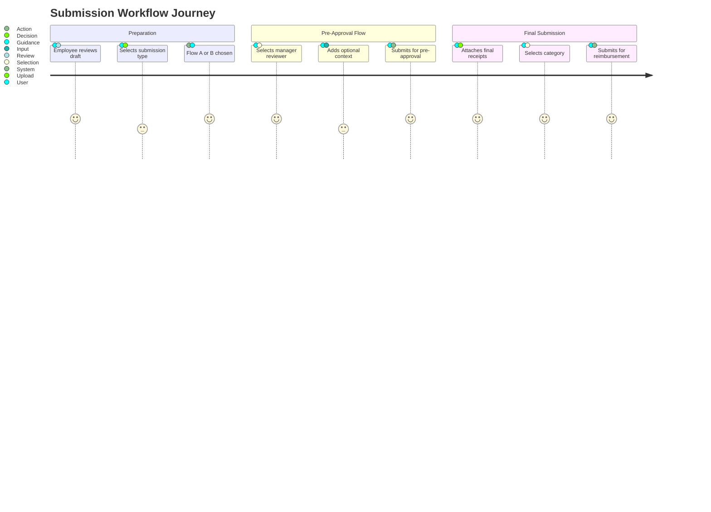
```mermaid
journey
  title Submission Workflow Journey
  section Preparation
    Employee reviews draft: 4: User, Review
    Selects submission type: 3: User, Decision
    Flow A or B chosen: 4: System, Guidance
  section Pre-Approval Flow
    Selects manager reviewer: 4: User, Selection
    Adds optional context: 3: User, Input
    Submits for pre-approval: 4: User, Action
  section Final Submission
    Attaches final receipts: 4: User, Upload
    Selects category: 4: User, Selection
    Submits for reimbursement: 4: User, Action
```

### Wireframe Concepts
- **Flow Selector:** Clear A/B choice with explanations
- **Progressive Forms:** Fields appear based on selected flow
- **Manager Picker:** Verified list with availability indicators
- **Submission Summary:** Clear preview before final action

### Component Requirements (Feature Component Pattern)
```typescript
// components/features/SubmitExpense.tsx
interface SubmitExpenseProps {
  expenseId: string;
  onSuccess?: () => void;
}

export function SubmitExpense({ expenseId, onSuccess }: SubmitExpenseProps) {
  const [flow, setFlow] = useState<'A' | 'B'>('B');

  const handleSubmit = async (data: SubmissionData) => {
    if (flow === 'A') {
      await submitForFinalApprovalAction({ expenseId, ...data });
    } else {
      await submitForPreApprovalAction({ expenseId, ...data });
    }
    // Success animation
    await animateSubmissionSuccess();
    onSuccess?.();
  };

  return (
    <Dialog>
      <DialogTrigger asChild>
        <Button>Submit for Approval</Button>
      </DialogTrigger>
      <DialogContent className="max-w-2xl">
        <FlowSelector value={flow} onChange={setFlow} />
        <SubmissionForm flow={flow} onSubmit={handleSubmit} />
      </DialogContent>
    </Dialog>
  );
}

// components/features/FlowSelector.tsx
interface FlowSelectorProps {
  value: 'A' | 'B';
  onChange: (flow: 'A' | 'B') => void;
}

export function FlowSelector({ value, onChange }: FlowSelectorProps) {
  return (
    <Tabs value={value} onValueChange={onChange}>
      <TabsList className="grid w-full grid-cols-2">
        <TabsTrigger value="B">Pre-Approval (Recommended)</TabsTrigger>
        <TabsTrigger value="A">Final Submission</TabsTrigger>
      </TabsList>
      <TabsContent value="B" className="mt-4">
        <p className="text-sm text-muted-foreground">
          Submit for manager review first, then add final receipts later.
        </p>
      </TabsContent>
      <TabsContent value="A" className="mt-4">
        <p className="text-sm text-muted-foreground">
          Submit complete expense with all receipts and details.
        </p>
      </TabsContent>
    </Tabs>
  );
}
```

### Interaction Patterns (DDD Principles)
- **Flow Guidance:** Clear explanations help users choose correctly
- **Progressive Forms:** Fields appear contextually to reduce overwhelm
- **Optimistic Submission:** Immediate UI feedback before backend processing
- **State Clarity:** Clear indication of current approval stage

### Responsive Design Considerations
- **Mobile:** Step-by-step wizard flow
- **Desktop:** Tabbed interface with all options visible
- **Tablet:** Compact tab layout

### Accessibility Requirements
- **Flow Descriptions:** Screen reader explains A/B differences
- **Progressive Disclosure:** Fields announced as they appear
- **Submission Confirmation:** Clear success/error feedback

---

## Story 3.3: Manager Approval/Rejection State Machine

### User Journey Flow
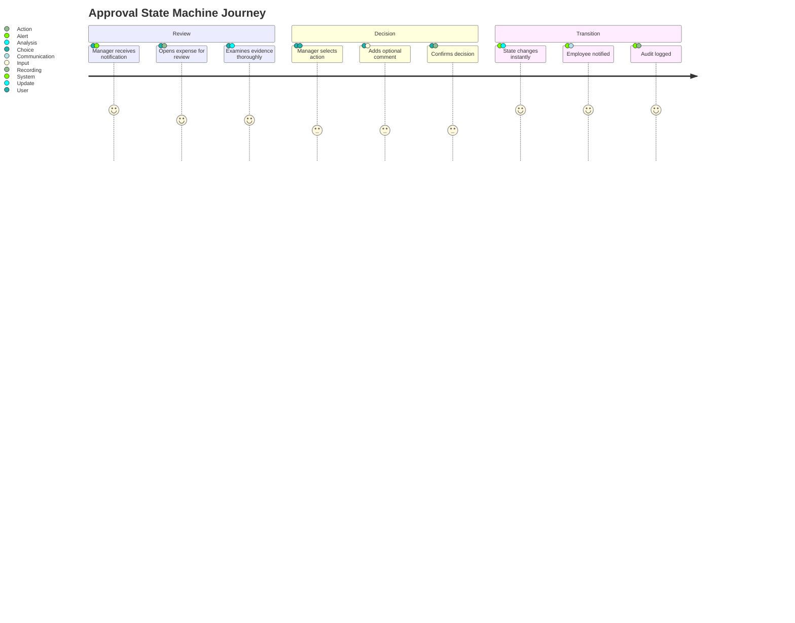
```mermaid
journey
  title Approval State Machine Journey
  section Review
    Manager receives notification: 5: User, Alert
    Opens expense for review: 4: User, Action
    Examines evidence thoroughly: 4: User, Analysis
  section Decision
    Manager selects action: 3: User, Choice
    Adds optional comment: 3: User, Input
    Confirms decision: 3: User, Action
  section Transition
    State changes instantly: 5: System, Update
    Employee notified: 5: System, Communication
    Audit logged: 5: System, Recording
```

### Wireframe Concepts
- **State Indicators:** Clear visual status badges
- **Action Buttons:** Prominent approve/reject with glow states
- **Comment Field:** Optional feedback input
- **Transition Animation:** Smooth state changes with micro-feedback

### Component Requirements (Feature Component Pattern)
```typescript
// components/features/ApprovalActions.tsx
interface ApprovalActionsProps {
  expenseId: string;
  currentState: ExpenseState;
  onStateChange?: (newState: ExpenseState) => void;
}

export function ApprovalActions({ expenseId, currentState, onStateChange }: ApprovalActionsProps) {
  const [approving, setApproving] = useState(false);
  const [rejecting, setRejecting] = useState(false);

  const handleApprove = async () => {
    setApproving(true);
    try {
      const newState = await approveExpenseAction(expenseId);
      // Success glow animation
      await animateApprovalSuccess();
      onStateChange?.(newState);
    } finally {
      setApproving(false);
    }
  };

  const handleReject = async (reason: string) => {
    setRejecting(true);
    try {
      const newState = await rejectExpenseAction(expenseId, reason);
      // Soft amber feedback
      await animateRejectionFeedback();
      onStateChange?.(newState);
    } finally {
      setRejecting(false);
    }
  };

  return (
    <div className="flex gap-2">
      <Button
        onClick={handleApprove}
        disabled={approving}
        className="bg-emerald-600 hover:bg-emerald-700"
      >
        {approving ? 'Approving...' : 'Approve'}
      </Button>
      <RejectDialog onConfirm={handleReject} disabled={rejecting} />
    </div>
  );
}

// components/features/StateTransitionIndicator.tsx
interface StateTransitionIndicatorProps {
  fromState: ExpenseState;
  toState: ExpenseState;
  animated?: boolean;
}

export function StateTransitionIndicator({ fromState, toState, animated = true }: StateTransitionIndicatorProps) {
  return (
    <motion.div
      initial={{ opacity: 0, scale: 0.8 }}
      animate={{ opacity: 1, scale: 1 }}
      transition={{ type: "spring", stiffness: 300, damping: 30 }}
    >
      <Badge variant="outline" className="bg-emerald-50 text-emerald-700 border-emerald-200">
        {fromState} → {toState}
      </Badge>
    </motion.div>
  );
}
```

### Interaction Patterns (DDD Principles)
- **Instant Feedback:** One-click approval with immediate UI updates
- **State Clarity:** Clear visual transitions between states
- **Rejection Sensitivity:** Optional comments with empathetic tone
- **Audit Transparency:** All actions logged and visible

### Responsive Design Considerations
- **Mobile:** Stacked action buttons with full-width touch targets
- **Desktop:** Inline buttons with hover states
- **Tablet:** Balanced button sizing

### Accessibility Requirements
- **Button States:** Clear loading and disabled states
- **State Announcements:** Screen reader announces state changes
- **Optional Comments:** Rejection reason clearly associated

---

## Story 3.4: Self-Approval Prevention Guard

### User Journey Flow
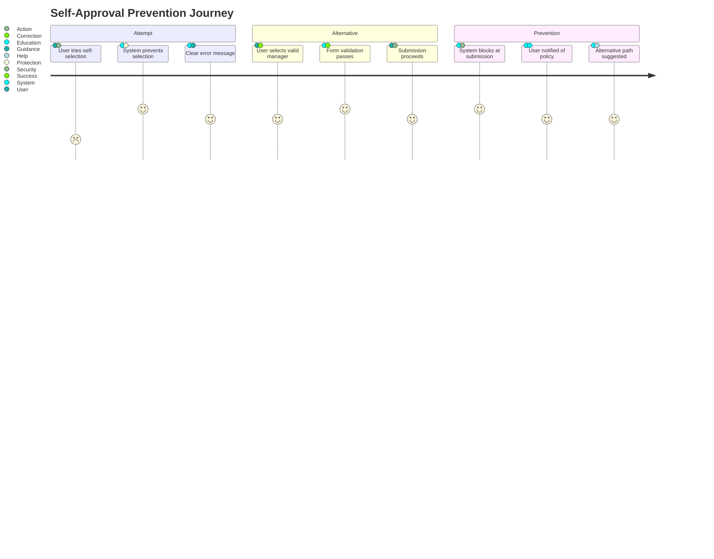
```mermaid
journey
  title Self-Approval Prevention Journey
  section Attempt
    User tries self-selection: 2: User, Action
    System prevents selection: 5: System, Protection
    Clear error message: 4: System, Guidance
  section Alternative
    User selects valid manager: 4: User, Correction
    Form validation passes: 5: System, Success
    Submission proceeds: 4: User, Action
  section Prevention
    System blocks at submission: 5: System, Security
    User notified of policy: 4: System, Education
    Alternative path suggested: 4: System, Help
```

### Wireframe Concepts
- **Manager Picker:** Filtered dropdown excluding self
- **Error States:** Clear prevention messaging
- **Policy Explanation:** Tooltip explaining the business rule
- **Alternative Guidance:** Suggestions for valid reviewers

### Component Requirements (Feature Component Pattern)
```typescript
// components/features/ManagerSelector.tsx
interface ManagerSelectorProps {
  orgId: string;
  excludeUserId?: string;
  value?: string;
  onChange: (managerId: string) => void;
}

export function ManagerSelector({ orgId, excludeUserId, value, onChange }: ManagerSelectorProps) {
  const { managers, isLoading } = useOrgManagers(orgId, { excludeUserId });

  if (isLoading) return <ManagerSkeleton />;

  return (
    <div className="space-y-2">
      <Label htmlFor="manager-select">
        Select Manager Reviewer
        <Tooltip>
          <TooltipTrigger>
            <Info className="h-4 w-4 ml-1" />
          </TooltipTrigger>
          <TooltipContent>
            Choose a manager to review your expense. 
            Self-approval is not permitted for compliance reasons.
          </TooltipContent>
        </Tooltip>
      </Label>
      <Select value={value} onValueChange={onChange}>
        <SelectTrigger id="manager-select">
          <SelectValue placeholder="Choose a manager..." />
        </SelectTrigger>
        <SelectContent>
          {managers.map(manager => (
            <SelectItem key={manager.id} value={manager.id}>
              {manager.name} - {manager.role}
            </SelectItem>
          ))}
        </SelectContent>
      </Select>
    </div>
  );
}

// lib/validations/expense.ts - Enhanced validation
export const submissionSchema = z.object({
  managerId: z.string().min(1, 'Manager selection required'),
  expenseId: z.string()
}).refine(async (data) => {
  // Server-side validation prevents self-approval
  const expense = await db.expenses.findById(data.expenseId);
  if (expense.submitterId === data.managerId) {
    throw new Error('Self-approval is not permitted');
  }
  return true;
}, {
  message: 'Cannot select yourself as the reviewer',
  path: ['managerId']
});
```

### Interaction Patterns (DDD Principles)
- **Prevention First:** UI prevents invalid selections proactively
- **Clear Messaging:** Explains why self-approval is blocked
- **Guidance Focus:** Suggests valid alternatives immediately
- **Policy Education:** Helps users understand the business rule

### Responsive Design Considerations
- **Mobile:** Full-width selector with clear touch targets
- **Desktop:** Compact dropdown with tooltip guidance
- **Tablet:** Balanced sizing with accessible tooltips

### Accessibility Requirements
- **Error Association:** Validation errors linked to selector
- **Screen Reader:** Announces prevention and alternatives
- **Keyboard Support:** Full navigation through manager options

---

## Story 4.1: Finance Global Audit Dashboard

### User Journey Flow
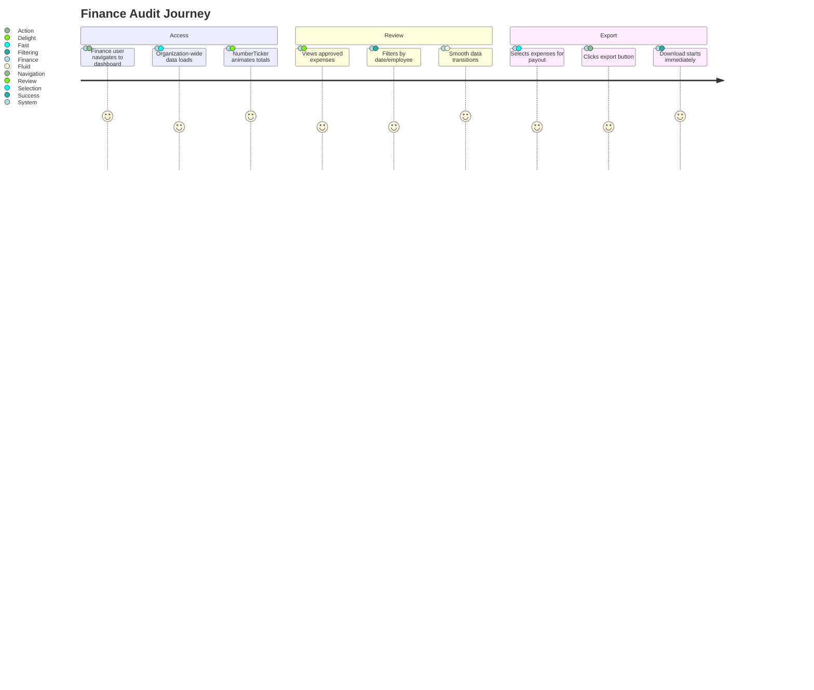
```mermaid
journey
  title Finance Audit Journey
  section Access
    Finance user navigates to dashboard: 5: Finance, Navigation
    Organization-wide data loads: 4: System, Fast
    NumberTicker animates totals: 5: System, Delight
  section Review
    Views approved expenses: 4: Finance, Review
    Filters by date/employee: 4: Finance, Filtering
    Smooth data transitions: 5: System, Fluid
  section Export
    Selects expenses for payout: 4: Finance, Selection
    Clicks export button: 4: Finance, Action
    Download starts immediately: 5: System, Success
```

### Wireframe Concepts
- **Executive Summary:** Prominent total payout with NumberTicker
- **Expense Table:** Sortable table with bulk selection
- **Filter Panel:** Date range, employee, category filters
- **Export Options:** CSV and PDF buttons with loading states
- **Detail Modal:** Side-by-side receipt and data view

### Component Requirements (Feature Component Pattern)
```typescript
// app/dashboard/finance/page.tsx
export default function FinanceDashboard() {
  return (
    <PageTransition>
      <FinanceHeader />
      <FinanceSummaryCards />
      <FinanceFilters />
      <FinanceExpenseTable />
      <FinanceExportActions />
    </PageTransition>
  );
}

// app/dashboard/finance/_components/finance-dashboard.tsx
interface FinanceDashboardProps {
  expenses: ApprovedExpense[];
  totalPayout: number;
  isLoading: boolean;
}

export function FinanceDashboard({ 
  expenses, 
  totalPayout, 
  isLoading 
}: FinanceDashboardProps) {
  return (
    <div className="finance-dashboard">
      <div className="summary-cards">
        <Card>
          <CardHeader>
            <CardTitle>Total Payout</CardTitle>
          </CardHeader>
          <CardContent>
            <NumberTicker value={totalPayout} prefix="$" />
          </CardContent>
        </Card>
      </div>
      
      <DataTable
        data={expenses}
        columns={financeColumns}
        loading={isLoading}
        onSelectionChange={setSelectedExpenses}
      />
      
      <ExportActions 
        selectedExpenses={selectedExpenses}
        onExportCSV={() => exportCSV(selectedExpenses)}
        onExportPDF={() => exportPDF(selectedExpenses)}
      />
    </div>
  );
}
```

### Interaction Patterns (DDD Principles)
- **Data Loading:** Skeleton tables with staggered row reveals
- **Number Animation:** Smooth NumberTicker for financial totals
- **Filter Transitions:** Smooth data updates with loading overlays
- **Export Feedback:** Success glow on completed downloads
- **Bulk Selection:** Visual feedback for selected rows

### Responsive Design Considerations
- **Mobile:** Card-based layout with expandable details
- **Tablet:** Compact table with horizontal scroll
- **Desktop:** Full table layout with side panels

### Accessibility Requirements
- **Data Tables:** Proper table headers and navigation
- **Number Formatting:** Screen reader friendly currency announcements
- **Filter Controls:** Clear labels and keyboard operation
- **Export Status:** Progress announcements for long exports

---

## Story 4.2: Payout Processing (Reimbursement)

### User Journey Flow
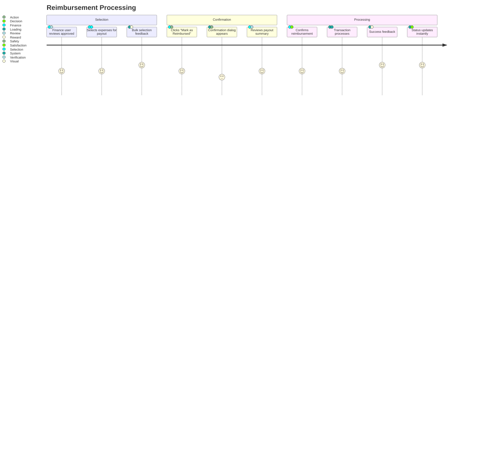
```mermaid
journey
  title Reimbursement Processing
  section Selection
    Finance user reviews approved: 4: Finance, Review
    Selects expenses for payout: 4: Finance, Selection
    Bulk selection feedback: 5: System, Visual
  section Confirmation
    Clicks "Mark as Reimbursed": 4: Finance, Action
    Confirmation dialog appears: 3: System, Safety
    Reviews payout summary: 4: Finance, Verification
  section Processing
    Confirms reimbursement: 4: Finance, Decision
    Transaction processes: 4: System, Loading
    Success feedback: 5: System, Reward
    Status updates instantly: 5: System, Satisfaction
```

### Wireframe Concepts
- **Bulk Selection:** Checkbox column with select all option
- **Confirmation Dialog:** Payout summary with employee breakdown
- **Processing States:** Loading overlays during batch operations
- **Success Feedback:** Clear completion messages with affected counts
- **Status Updates:** Immediate visual status changes

### Component Requirements (Feature Component Pattern)
```typescript
// app/dashboard/finance/_components/reimbursement-confirmation.tsx
interface ReimbursementConfirmationProps {
  selectedExpenses: Expense[];
  onConfirm: () => void;
  onCancel: () => void;
}

export function ReimbursementConfirmation({ 
  selectedExpenses, 
  onConfirm, 
  onCancel 
}: ReimbursementConfirmationProps) {
  const summary = calculateReimbursementSummary(selectedExpenses);
  
  return (
    <AlertDialog open={true} onOpenChange={onCancel}>
      <AlertDialogContent>
        <AlertDialogHeader>
          <AlertDialogTitle>Confirm Reimbursement</AlertDialogTitle>
          <AlertDialogDescription>
            This will mark {selectedExpenses.length} expenses as reimbursed.
          </AlertDialogDescription>
        </AlertDialogHeader>
        
        <ReimbursementSummary summary={summary} />
        
        <AlertDialogFooter>
          <AlertDialogCancel>Cancel</AlertDialogCancel>
          <AlertDialogAction onClick={onConfirm}>
            Confirm Reimbursement
          </AlertDialogAction>
        </AlertDialogFooter>
      </AlertDialogContent>
    </AlertDialog>
  );
}

// app/dashboard/finance/_components/reimbursement-summary.tsx
interface ReimbursementSummaryProps {
  summary: {
    totalAmount: number;
    employeeCount: number;
    expenseCount: number;
    employees: Array<{ name: string; amount: number; }>;
  };
}

export function ReimbursementSummary({ summary }: ReimbursementSummaryProps) {
  return (
    <div className="reimbursement-summary">
      <div className="total-section">
        <h4>Total Payout</h4>
        <NumberTicker value={summary.totalAmount} prefix="$" />
      </div>
      
      <div className="breakdown">
        <p>{summary.expenseCount} expenses for {summary.employeeCount} employees</p>
        <div className="employee-breakdown">
          {summary.employees.map(employee => (
            <div key={employee.name} className="employee-row">
              <span>{employee.name}</span>
              <NumberTicker value={employee.amount} prefix="$" />
            </div>
          ))}
        </div>
      </div>
    </div>
  );
}
```

### Interaction Patterns (DDD Principles)
- **Selection Feedback:** Visual row highlighting on selection
- **Confirmation Safety:** Modal prevents accidental bulk operations
- **Processing Animation:** Loading states with progress indication
- **Success Celebration:** Emerald glow and toast notifications
- **Instant Updates:** Optimistic UI updates status immediately

### Responsive Design Considerations
- **Mobile:** Full-screen confirmation dialogs
- **Tablet:** Optimized modal sizing
- **Desktop:** Side panel or centered modal

### Accessibility Requirements
- **Bulk Operations:** Clear selection counts and affected items
- **Confirmation Clarity:** High contrast warnings and clear actions
- **Progress Updates:** Screen reader announcements during processing
- **Error Recovery:** Clear error states with retry options

---

## Story 4.3: Financial Data Export (CSV/PDF)

### User Journey Flow
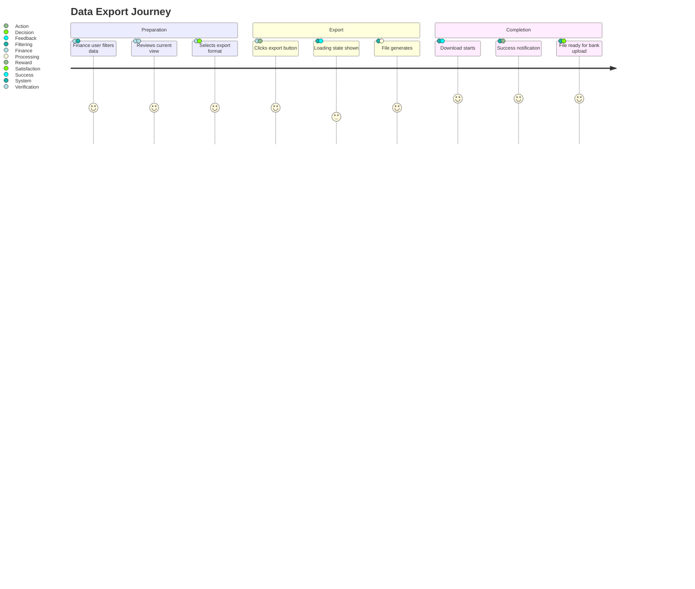
```mermaid
journey
  title Data Export Journey
  section Preparation
    Finance user filters data: 4: Finance, Filtering
    Reviews current view: 4: Finance, Verification
    Selects export format: 4: Finance, Decision
  section Export
    Clicks export button: 4: Finance, Action
    Loading state shown: 3: System, Feedback
    File generates: 4: System, Processing
  section Completion
    Download starts: 5: System, Success
    Success notification: 5: System, Reward
    File ready for bank upload: 5: System, Satisfaction
```

### Wireframe Concepts
- **Export Controls:** CSV and PDF buttons with format selection
- **Progress Feedback:** Loading states during generation
- **File Information:** Size and record count in success messages
- **Format Preview:** Sample of export structure
- **Security Notice:** Data handling transparency

### Component Requirements (Feature Component Pattern)
```typescript
// app/dashboard/finance/_components/export-actions.tsx
interface ExportActionsProps {
  selectedExpenses: Expense[];
  onExportCSV: () => void;
  onExportPDF: () => void;
  isExporting: boolean;
}

export function ExportActions({ 
  selectedExpenses, 
  onExportCSV, 
  onExportPDF,
  isExporting 
}: ExportActionsProps) {
  return (
    <div className="export-actions">
      <div className="export-buttons">
        <Button
          onClick={onExportCSV}
          disabled={isExporting || selectedExpenses.length === 0}
          className="export-btn"
        >
          {isExporting ? (
            <LoadingSpinner />
          ) : (
            <>
              <DownloadIcon />
              Export CSV
            </>
          )}
        </Button>
        
        <Button
          onClick={onExportPDF}
          disabled={isExporting || selectedExpenses.length === 0}
          variant="outline"
          className="export-btn"
        >
          {isExporting ? (
            <LoadingSpinner />
          ) : (
            <>
              <FileIcon />
              Export PDF
            </>
          )}
        </Button>
      </div>
      
      <div className="export-info">
        <p className="text-sm text-muted-foreground">
          {selectedExpenses.length} expenses selected • 
          Estimated file size: {calculateFileSize(selectedExpenses)}KB
        </p>
      </div>
    </div>
  );
}

// lib/utils/export.ts
export function generateCSV(expenses: Expense[]): string {
  const headers = ['Date', 'Employee', 'Amount', 'Category', 'Description'];
  const rows = expenses.map(expense => [
    formatDate(expense.date),
    expense.employeeName,
    formatCurrency(expense.amount),
    expense.category,
    expense.description
  ]);
  
  return [headers, ...rows]
    .map(row => row.map(cell => `"${cell.replace(/"/g, '""')}"`).join(','))
    .join('\n');
}
```

### Interaction Patterns (DDD Principles)
- **Export Initiation:** Immediate button feedback and loading states
- **Progress Communication:** Clear file generation progress
- **Completion Reward:** Success glow and download confirmation
- **File Information:** Helpful metadata about generated files
- **Error Recovery:** Clear error messages with retry options

### Responsive Design Considerations
- **Mobile:** Stacked export buttons with full-width layout
- **Tablet:** Side-by-side buttons with info below
- **Desktop:** Inline layout with detailed file information

### Accessibility Requirements
- **Button States:** Clear disabled states and loading announcements
- **Progress Tracking:** Screen reader friendly progress updates
- **File Information:** Descriptive text about export contents
- **Error Handling:** Clear error messages with actionable recovery

---

## Story 5.1: High-Fidelity Feedback Library (Motion 12)

### User Journey Flow
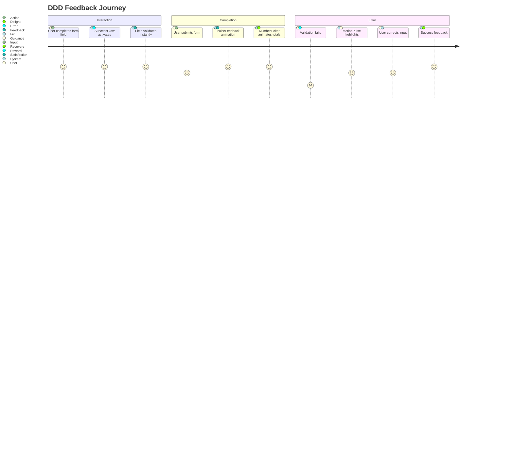
```mermaid
journey
  title DDD Feedback Journey
  section Interaction
    User completes form field: 5: User, Input
    SuccessGlow activates: 5: System, Reward
    Field validates instantly: 5: System, Feedback
  section Completion
    User submits form: 4: User, Action
    PulseFeedback animation: 5: System, Satisfaction
    NumberTicker animates totals: 5: System, Delight
  section Error
    Validation fails: 2: User, Error
    MotionPulse highlights: 4: System, Guidance
    User corrects input: 4: User, Fix
    Success feedback: 5: System, Recovery
```

### Wireframe Concepts
- **Success Glow:** Emerald aura around completed actions
- **Pulse Feedback:** Subtle scaling animations for state changes
- **Number Ticker:** Fluid numeric transitions
- **Motion Pulse:** Amber highlighting for attention
- **Component Library:** Reusable DDD components

### Component Requirements (Feature Component Pattern)
```typescript
// components/ddd/index.ts - Component exports
export { SuccessGlow } from './SuccessGlow';
export { PulseFeedback } from './PulseFeedback';
export { NumberTicker } from './NumberTicker';
export { MotionPulse } from './MotionPulse';

// components/ddd/SuccessGlow.tsx
interface SuccessGlowProps {
  children: React.ReactNode;
  trigger: boolean;
  duration?: number;
  intensity?: 'subtle' | 'medium' | 'strong';
}

export function SuccessGlow({ 
  children, 
  trigger, 
  duration = 500,
  intensity = 'medium' 
}: SuccessGlowProps) {
  const glowIntensity = {
    subtle: '0 0 10px rgba(16, 185, 129, 0.3)',
    medium: '0 0 15px rgba(16, 185, 129, 0.5)',
    strong: '0 0 20px rgba(16, 185, 129, 0.7)'
  };
  
  return (
    <motion.div
      animate={trigger ? {
        boxShadow: glowIntensity[intensity]
      } : {
        boxShadow: '0 0 0px rgba(16, 185, 129, 0)'
      }}
      transition={{ 
        duration: duration / 1000,
        ease: 'easeOut'
      }}
      className="success-glow-wrapper"
    >
      {children}
    </motion.div>
  );
}

// components/ddd/NumberTicker.tsx
interface NumberTickerProps {
  value: number;
  duration?: number;
  prefix?: string;
  suffix?: string;
}

export function NumberTicker({ 
  value, 
  duration = 500,
  prefix = '',
  suffix = ''
}: NumberTickerProps) {
  const [displayValue, setDisplayValue] = useState(value);
  
  useEffect(() => {
    const startValue = displayValue;
    const endValue = value;
    const startTime = Date.now();
    
    const animate = () => {
      const now = Date.now();
      const elapsed = now - startTime;
      const progress = Math.min(elapsed / duration, 1);
      
      const currentValue = startValue + (endValue - startValue) * progress;
      setDisplayValue(currentValue);
      
      if (progress < 1) {
        requestAnimationFrame(animate);
      }
    };
    
    requestAnimationFrame(animate);
  }, [value, duration]);
  
  return (
    <span className="number-ticker">
      {prefix}{displayValue.toFixed(2)}{suffix}
    </span>
  );
}
```

### Interaction Patterns (DDD Principles)
- **Success Glow:** Emerald aura for positive completions
- **Pulse Feedback:** Opacity transitions for state changes
- **Number Animation:** Smooth numeric transitions
- **Motion Pulse:** Scale animations for attention
- **Reduced Motion:** Respects user preferences

### Responsive Design Considerations
- **Performance:** GPU acceleration on all devices
- **Adaptation:** Animations scale appropriately for screen size
- **Accessibility:** Reduced motion alternatives always available

### Accessibility Requirements
- **Reduced Motion:** Full support for prefers-reduced-motion
- **Screen Reader:** Animations don't interfere with screen readers
- **Performance:** Animations don't cause layout shifts
- **Focus:** Animations don't steal focus inappropriately

---

## Story 5.2: Fluid Layout Transitions & Skeletons

### User Journey Flow
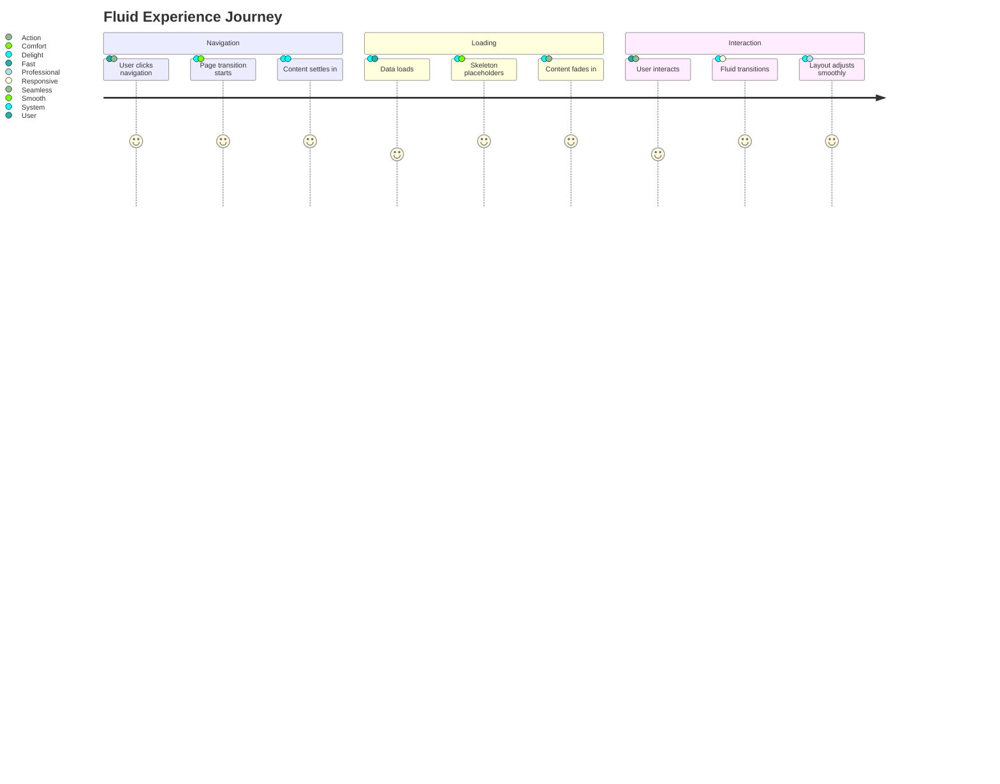
```mermaid
journey
  title Fluid Experience Journey
  section Navigation
    User clicks navigation: 5: User, Action
    Page transition starts: 5: System, Smooth
    Content settles in: 5: System, Delight
  section Loading
    Data loads: 4: System, Fast
    Skeleton placeholders: 5: System, Comfort
    Content fades in: 5: System, Seamless
  section Interaction
    User interacts: 4: User, Action
    Fluid transitions: 5: System, Responsive
    Layout adjusts smoothly: 5: System, Professional
```

### Wireframe Concepts
- **Page Transitions:** Smooth route changes with spring physics
- **Skeleton Loaders:** Brand-aligned placeholder content
- **Staggered Animations:** Sequential element reveals
- **Layout Continuity:** Shared layout IDs for smooth transitions
- **Loading Overlays:** Non-blocking data refresh feedback

### Component Requirements (Feature Component Pattern)
```typescript
// components/layout/page-transitions.tsx
interface PageTransitionProps {
  children: React.ReactNode;
  direction?: 'up' | 'down' | 'left' | 'right';
}

export function PageTransition({ 
  children, 
  direction = 'up' 
}: PageTransitionProps) {
  const directionOffset = {
    up: { y: 20, opacity: 0 },
    down: { y: -20, opacity: 0 },
    left: { x: 20, opacity: 0 },
    right: { x: -20, opacity: 0 }
  };
  
  return (
    <motion.div
      initial={directionOffset[direction]}
      animate={{ y: 0, x: 0, opacity: 1 }}
      exit={directionOffset[direction]}
      transition={{
        type: 'spring',
        damping: 25,
        stiffness: 120
      }}
      className="page-transition-wrapper"
    >
      {children}
    </motion.div>
  );
}

// components/layout/data-transitions.tsx
interface LoadingOverlayProps {
  isLoading: boolean;
  children: React.ReactNode;
}

export function LoadingOverlay({ isLoading, children }: LoadingOverlayProps) {
  return (
    <AnimatePresence>
      {isLoading && (
        <motion.div
          initial={{ opacity: 0 }}
          animate={{ opacity: 1 }}
          exit={{ opacity: 0 }}
          className="loading-overlay"
        >
          <div className="shimmer-effect" />
        </motion.div>
      )}
      <motion.div
        animate={{ opacity: isLoading ? 0.5 : 1 }}
        transition={{ duration: 0.2 }}
      >
        {children}
      </motion.div>
    </AnimatePresence>
  );
}

// components/ui/skeleton.tsx
interface SkeletonProps {
  variant?: 'text' | 'rectangular' | 'circular';
  width?: string | number;
  height?: string | number;
  className?: string;
}

export function Skeleton({ 
  variant = 'rectangular',
  width = '100%',
  height = '1rem',
  className = ''
}: SkeletonProps) {
  const baseClasses = 'skeleton-loader';
  const variantClasses = {
    text: 'skeleton-text',
    rectangular: 'skeleton-rectangular', 
    circular: 'skeleton-circular'
  };
  
  return (
    <motion.div
      className={`${baseClasses} ${variantClasses[variant]} ${className}`}
      style={{ width, height }}
      initial={{ opacity: 0.5 }}
      animate={{ 
        opacity: [0.5, 1, 0.5],
        backgroundPosition: ['-200px 0', '200px 0']
      }}
      transition={{
        opacity: { duration: 1.5, repeat: Infinity, ease: 'easeInOut' },
        backgroundPosition: { duration: 1, repeat: Infinity, ease: 'linear' }
      }}
    />
  );
}
```

### Interaction Patterns (DDD Principles)
- **Spring Physics:** Natural, bouncy transitions
- **Staggered Reveals:** Sequential content loading
- **Skeleton Comfort:** Familiar shapes during loading
- **Layout Continuity:** Elements maintain position during transitions
- **GPU Acceleration:** Transform-based animations

### Responsive Design Considerations
- **Mobile:** Optimized transition distances
- **Tablet:** Balanced animation timing
- **Desktop:** Full spring physics for smooth transitions

### Accessibility Requirements
- **Reduced Motion:** Static alternatives for all transitions
- **Screen Reader:** Loading states announced appropriately
- **Focus Management:** Transitions don't break focus flow
- **Performance:** Animations don't cause motion sickness

---

## Implementation Priority & Dependencies

### Phase 1: Foundation (Stories 1.1-1.3)
- Data validation and form patterns
- Basic expense creation workflow
- Core DDD feedback components

### Phase 2: Enhancement (Stories 1.4-1.6)  
- File upload capabilities
- Draft management features
- Upload zone fixes

### Phase 3: Finance (Stories 4.1-4.3)
- Finance dashboard and audit views
- Payout processing workflows
- Data export functionality

### Phase 4: Polish (Stories 5.1-5.2)
- High-fidelity feedback library
- Fluid layout transitions
- Performance optimization

## Success Metrics

- **User Satisfaction:** <200ms perceived latency achieved
- **Accessibility:** WCAG 2.1 AA compliance maintained
- **Performance:** 60fps animations across target devices
- **Conversion:** Smooth dopamine-driven user flows
- **Developer Experience:** Reusable component library adoption

This comprehensive UX specification provides the foundation for implementing a premium, high-performance expense management application that delights users through thoughtful design and seamless interactions.